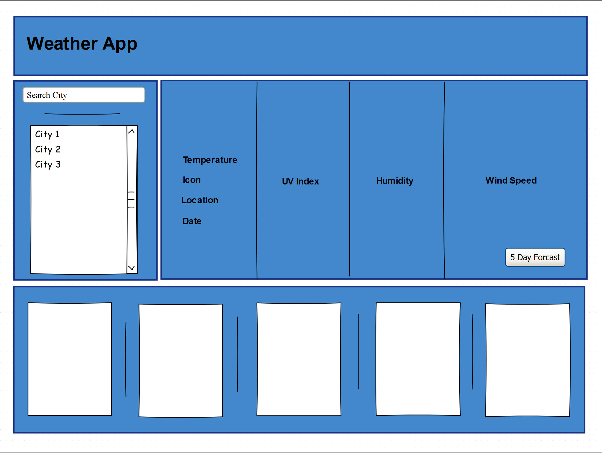
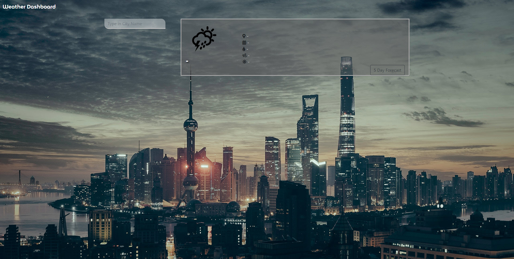
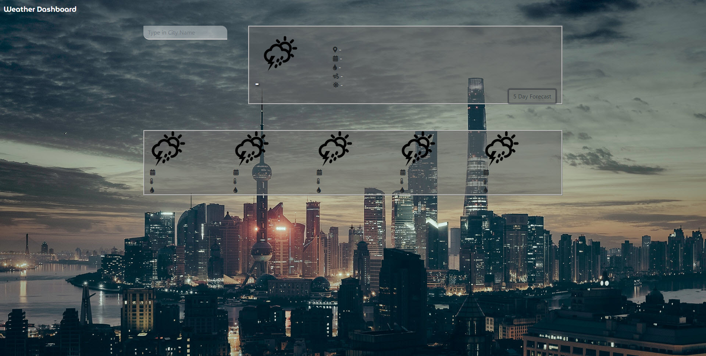
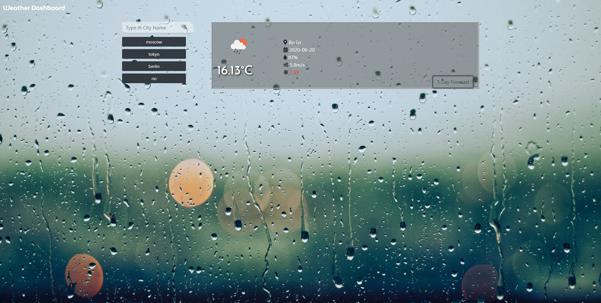
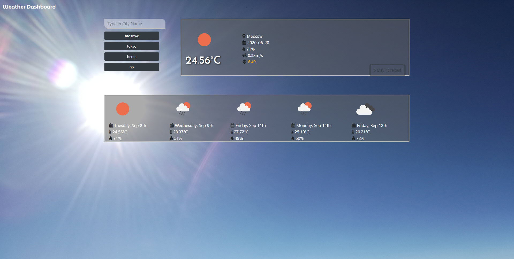
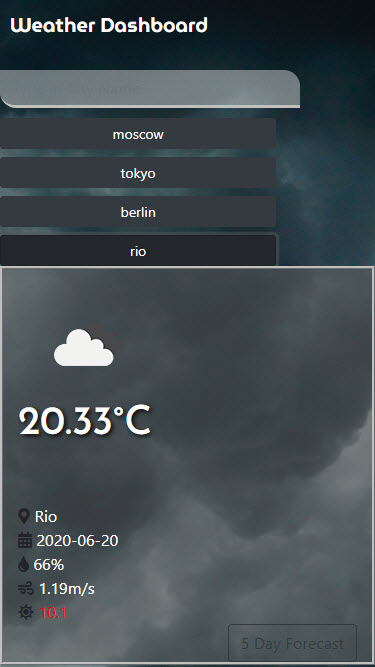

# MBC-unit2

## Application & Repository Link

###### [Application Link](https://suji-gith.github.io/MBC-Assignments/Assignment-6/WeatherDashboard.html)

###### [Repository Link](https://github.com/Suji-GitH/MBC-Assignments/tree/master/Assignment-6)

## Content
- [Overview](#Overview)
- [Acceptance Criteria](#AcceptanceCriteria)
- [UI/UX & Application Screens](#UI/UX&ApplicationScreens)
    - [UI/UX Consideration](#UI/UXConsideration)
    - [App Screenshots](#AppScreenshots)
- [Credits](#Credits)
- [Testing](#Testing)

## Overview

AS A traveler
I WANT to see the weather outlook for multiple cities
SO THAT I can plan a trip accordingly

## AcceptanceCriteria

```
GIVEN a weather dashboard with form inputs
WHEN I search for a city
THEN I am presented with current and future conditions for that city and that city is added to the search history
WHEN I view current weather conditions for that city
THEN I am presented with the city name, the date, an icon representation of weather conditions, the temperature, the humidity, the wind speed, and the UV index
WHEN I view the UV index
THEN I am presented with a color that indicates whether the conditions are favorable, moderate, or severe
WHEN I view future weather conditions for that city
THEN I am presented with a 5-day forecast that displays the date, an icon representation of weather conditions, the temperature, and the humidity
WHEN I click on a city in the search history
THEN I am again presented with current and future conditions for that city
WHEN I open the weather dashboard
THEN I am presented with the last searched city forecast
```

## UI/UX&ApplicationScreens

###### UI/UXConsideration


###### AppScreenshots

initial wire frame for the application layout


Weather App Dashboard - Default State


Weather App Dashboard - 5 Day Forecast Default


Weather App Dashboard - Rendered Weather Details 


Weather App Dashboard - Rendered Weather Details with 5 Day Forecast


Weather App Dashboard - Mobile View


## Credits

    - Bootstrap
    - Google Fonts
    - Favicon.io 
    - jQuery
    - Moment.js 
    - Font Awesome

## Testing


    
